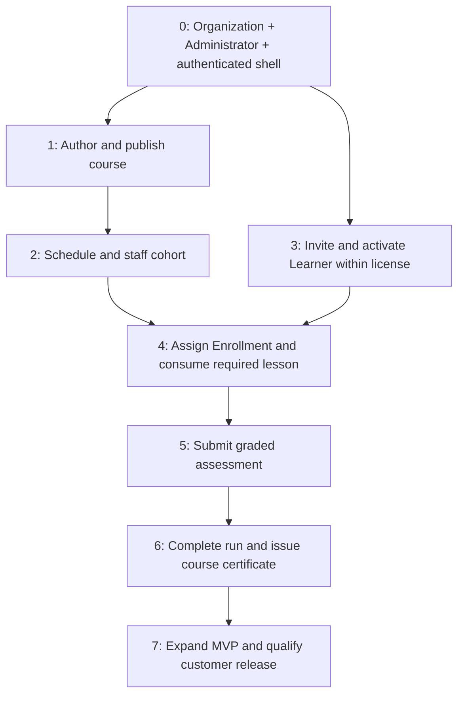

# First implementation sequence

> **Status:** Slices 0–2 implemented; later slices and their product gates remain\
> **Authority:** Supporting implementation plan\
> **Updated:** 2026-09-18

## Purpose and execution rule

Build a narrow, end-to-end walking skeleton across real module contracts, PostgreSQL and React/ASP.NET Core. Expand each working slice with its behavior tests. Do not build every entity, then every API, then every screen. The original consolidation was documentation-only; execution status is recorded per slice below.

Use the [source map](../README.md), owning feature and [invariants](../06-architecture/implementation-invariants.md) for each slice. A gated product behavior remains unimplemented until resolved; use clearly labelled synthetic fixtures for development, never ship a guessed policy as a default. Engineering choices listed in the [question register](../00-product/open-questions.md#engineering-decisions--team-may-proceed) do not require a product meeting.

## Dependency path

The first complete path uses one course, one active cohort, one required text lesson and one single-choice graded quiz. It need not include forums, every question type, transfer, administrative certificate reissue or a second deployment platform. Decisions necessary even for that thin path (notably Q70 and Q72) must be closed before those steps.

## 0 — Establish organization, Administrator and authenticated shell

**Implemented 2026-09-18:** Host and private Identity module, controlled bootstrap, restricted PostgreSQL runtime, explicit locked migration command, protected persistent sessions, security commands/transactional audit and React account shell. The [local guide](../06-architecture/local-development.md) owns run/test commands and concrete defaults; the [HTTP contract](../04-api-design/identity-foundation.md) owns current API scope. Backend negative, concurrency, rollback, restart and database-permission checks pass. A minimal CI workflow and development Compose database are included. This does not complete the customer-release qualifications in slice 7.

**Validation:** 54 backend tests pass (including 16 PostgreSQL integration scenarios); all four desktop/mobile Chromium checks pass. Frontend production build, locked NuGet restore, shell syntax and 918 local documentation references pass. The CI workflow is authored; these are local results, not a claim that hosted CI has run. Production TLS/key-rotation/restore and customer packaging qualification remain in slice 7.

**Deliver:** Minimal .NET 10 host, React/Vite shell, module/contract boundaries, PostgreSQL connection and initial module-owned migrations, explicit migration command, restricted runtime role, persistent protected key ring, controlled one-time bootstrap and staff-only Administrator login/logout. Include current-state cookie ticket validation, policy entrypoints, CSRF, configuration validation, health/readiness, structured redacted logging and transactional audit. Start a minimal build/test pipeline and development Compose environment when implementation is authorized.

**Prove:** Bootstrap cannot be won by an arbitrary public visitor, cannot run twice, and has no reusable default password. Staff-only Administrator uses zero learner seats. Unauthenticated, forged-CSRF, inactive and stale-security-version requests fail. Synthetic second-organization fixtures prove isolation despite one operational organization. Concurrent final-Administrator changes preserve one usable account. Runtime cannot perform DDL. Broken configuration/schema fails readiness clearly.

**Dependencies/gates:** No foundational product blocker. Select concrete libraries/test tools as engineering work; use synthetic identities until Q57 is resolved for real data.

## 1 — Create and publish one course through the web application

**Implemented 2026-09-18:** Course Author membership UI/API; private Authoring module and migration 2; create/assign owner, save ordered draft modules/plain-text lessons, publication validation and read-only published content. Explicit ownership transfer is available through its API; its dedicated UI remains follow-up work. Required audit shares Identity's local transaction and security-write guard. The [authoring contract](../04-api-design/course-authoring.md) records the actual endpoint scope, bounds, retries and concurrency behavior. Rich text/reading links and live editing are not claimed complete by this thin slice.

**Validation:** 66 backend tests pass (28 real-PostgreSQL integration scenarios and 38 role/architecture cases); all eight desktop/mobile Chromium checks pass. Frontend build, locked dependency restore, unchanged migration 1 and 936 local documentation references were checked. The local development database was backed up and upgraded from v1 to v2 without re-bootstrap. Hosted CI and production recovery qualification remain separate from these local checks.

**Deliver:** Administrator grants/assigns Course Author using the explicit policy; author creates a draft, owner grant, one module, one required text lesson and its publication validation. React form → API → owner module → database is exercised now. No general-purpose CRUD for every entity.

**Prove:** Manager can grant Author but cannot grant Manager/Admin or use user/profile endpoints to take over privileged credentials. Owner and same-organization constraints hold. An unrelated Author cannot edit. Publication needs content and a nonzero completion denominator; no approval queue or learner public catalog is added.

**Dependencies/gates:** Slice 0. Live editing with existing learning records is deferred to Q74; initial publication does not need it.

## 2 — Schedule a cohort and establish its staff

**Implemented 2026-09-18:** Private Enrollment & Cohorts module and migration 3; published-course scheduling; atomic initial Coordinator and optional Facilitator grants; current staff-scoped list/detail; explicit staff changes; UTC schedule-derived lifecycle; narrow Coordinator/Facilitator account-role workflows; transactional staffing audit and Coordinator-continuity guard across grant revocation, role removal and deactivation. The React Cohorts screen schedules and displays staff, including one account holding both capabilities. The [cohort contract](../04-api-design/cohort-scheduling.md) records endpoints, transaction seams, bounds and retry behavior. Enrollment, learner access, withdrawal, course archive and cohort-start email are not claimed by this slice.

**Validation:** 73 backend tests pass (35 real-PostgreSQL integration scenarios and 38 role/architecture cases); all ten desktop/mobile Chromium checks pass. Frontend production build, locked dependency restore, unchanged migrations 1–2 and 64 affected-document local links/anchors were checked. The local development database was backed up and upgraded from v2 to v3 without re-bootstrap. Hosted CI and Q61 release-performance/recovery qualification remain separate.

**Deliver:** Published course selection, cohort schedule and eligible Coordinator grant atomically, optional Facilitator grant, staff view. The same account can hold both distinct capabilities.

**Prove:** No unstaffed active cohort, no cross-organization course/staff links, no resource grant that creates an account role. Coordinator can operate only the assigned cohort. Facilitator/Author alone cannot enroll learners. UTC and schedule-boundary tests work with an injected clock.

**Dependencies/gates:** Slice 1. The initial path uses a currently active cohort. Q69 gates before/after-window access, withdrawal and archive flows; do not add implicit transfer.

## 3 — Verify a license; invite and activate a Learner

**Deliver:** Signed version-1 license load/status, learner utilization, permitted role sets, pending invite, durable email-intent table/worker and token acceptance into an active Learner account. Develop with separate test issuer keys and interoperable vectors; no vendor billing application is required. Same release supports customer SMTP configuration.

**Prove:** Pending/staff/inactive consume zero; mixed-role active Learner consumes one. Race last-seat acceptance, reactivation, restoration and active-account Learner grants. Race license replacement using the same guard. Reject invalid signatures/org binding/schema/replayed revisions. Lost response/resend does not duplicate account. Crash after commit preserves email work; SMTP failure retries; invalid tokens do not activate. Role escalation paths and deactivation revocation are tested here as real workflows.

**Dependencies/gates:** Slice 0; may develop independently of course authoring. Valid unexpired capacity is sufficient for the thin path. Q68 must close before expired/suspended/downsize handling ships. Wire vectors/library choice are engineering validation.

## 4 — Assign a learning run and record reading progress

**Deliver:** Roster assignment creates a fresh Enrollment; learner dashboard opens that run and lesson. Implement the decided reading completion signal and a run-scoped progress display. Enrollment does not consume an additional seat.

**Prove:** Only Coordinator of that cohort, Administrator or Manager assigns. Learner must be active and hold Learner entitlement. Concurrent assignments preserve one active run per user/course; request retry returns the same run. Cross-course lesson/run IDs fail. Repeated completion signal is idempotent. Staff preview does not write learning evidence. Ordered lessons do not imply prerequisite locks.

**Dependencies/gates:** Slices 2 and 3; **Q70 before reading behavior**. Q69 before boundary/withdrawal behavior. Retain historical runs even if the UI initially shows only the current one.

## 5 — Submit and score one graded assessment

**Deliver:** Author defines a single-choice graded quiz; Learner starts/submits under the resolved attempt policy. Persist immutable submission, per-question answers, scoring-definition snapshot and exact pass result. Provide only the feedback approved by Q73. Add an audited allowance reset without deleting historical submissions.

**Prove:** Final-attempt races and repeated HTTP submissions do not consume twice. No answer key reaches the taking client. Request-key payload mismatch is rejected. Reset/submission races serialize and preserve history. Other cohorts/organizations cannot read or mutate attempts. Deactivation/grant loss during an attempt is enforced on submission. Pass evidence belongs to this Enrollment only.

**Dependencies/gates:** Slice 4; **Q72 and the thin path's feedback decision in Q73**. Q71 gates multi-select expansion, not this first question type. Q74 gates editing in-flight definitions; do not let an arbitrary CRUD endpoint bypass that gate.

## 6 — Complete the run and issue/download its course credential

**Deliver:** Consistent completion evaluation through public module contracts; persist Enrollment completion snapshot, first user/course Certificate and durable completion email in a local transaction. Render protected fixed-template PDF from frozen display data. Make processing/failed-render states understandable in the UI. Synchronous evaluation is the first default; add durable non-email work only if an actual operation is asynchronous.

**Prove:** Concurrent final evidence/retries complete the run once and issue one automatic credential. Critical audit/work persistence failure rolls back; SMTP/PDF failure after commit does not revoke completion. Restart workers and retry delivery. Complete a second genuine Enrollment with fresh progress/allowance: preserve both histories and link the existing course certificate. Course/branding edits do not rewrite completed snapshots. No public verification route is introduced.

**Dependencies/gates:** Slice 5. Q75 gates administrative void/reissue, not first automatic issuance. Q57 gates real personal-data retention. A working PDF library is an engineering choice, validated with actual fonts/assets and permitted licenses.

## 7 — Expand the MVP and qualify the customer release

Add the remaining quiz types after Q71, review/preview behavior after Q73, live-edit safeguards after Q74, full boundary/access rules after Q69, license lifecycle after Q68 and administrative certificate workflow after Q75. Add scoped forums/moderation and durable reply/cohort-start emails, role-appropriate progress views, account recovery and operational work inspection/retry. Keep each addition a tested vertical flow.

Package immutable application images and a versioned Compose release with compatibility manifest, release notes, configuration reference, separate migration invocation, backups and recovery runbook. Test upgrade from every declared supported source version, simultaneous migration lock, failure recovery, runtime schema refusal and restore of database/files/license/key material. Publish image digests; customer applies the release. Introduce Helm only when Q63 establishes supported demand. No auto-sync or mandatory vendor access.

**Release gates:** Q57 real-data policy, Q61 measurable capacity/recovery targets, Q63 supported environments, Q41 accessibility acceptance and Q78 distribution terms, plus all shipped feature gates. Validate the complete browser path, negative authorization matrix, concurrency and crash/retry cases against actual PostgreSQL. Record measured limitations; do not claim scale/zero-downtime/backup success from architecture prose alone.

## Definition of a completed slice

Feature, domain/entity/API changes and implementation/tests agree; relevant question gates are resolved; invariants have meaningful enforcement and negative tests; migration/upgrade implications and required audit are covered; affected derived docs are refreshed. Run targeted tests and required CI, and report any limits. Architecture tests enforce module dependencies from the first real modules onward. Avoid generic frameworks introduced solely for potential extraction.

## Open questions and related documents

[Question register](../00-product/open-questions.md) owns all product gates. Team estimates and deadlines remain program inputs; the sequence is dependency-based, not a calendar commitment.

[Readiness](readiness.md) · [MVP](mvp.md) · [Navigation](../05-frontend/navigation.md) · [Module boundaries](../06-architecture/module-boundaries.md)
